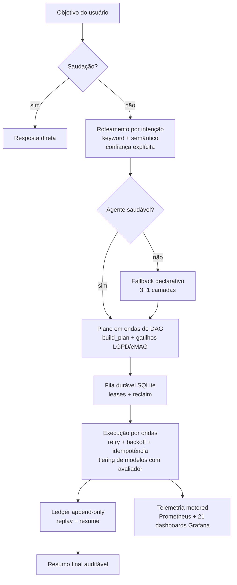
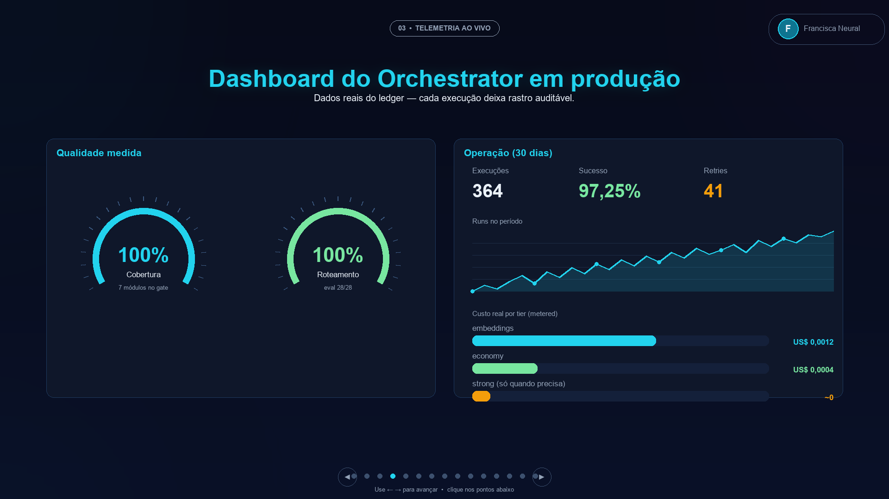
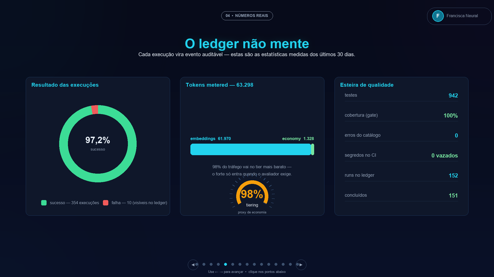
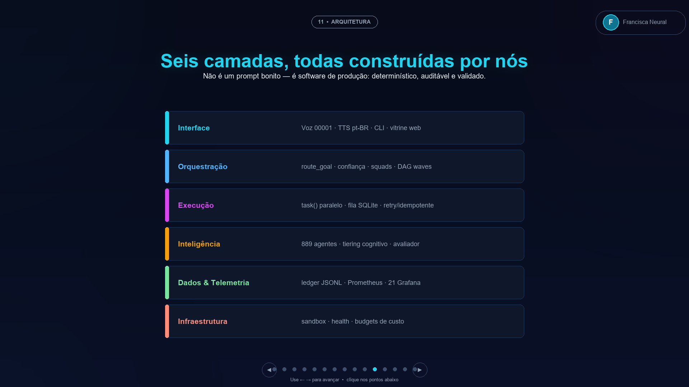
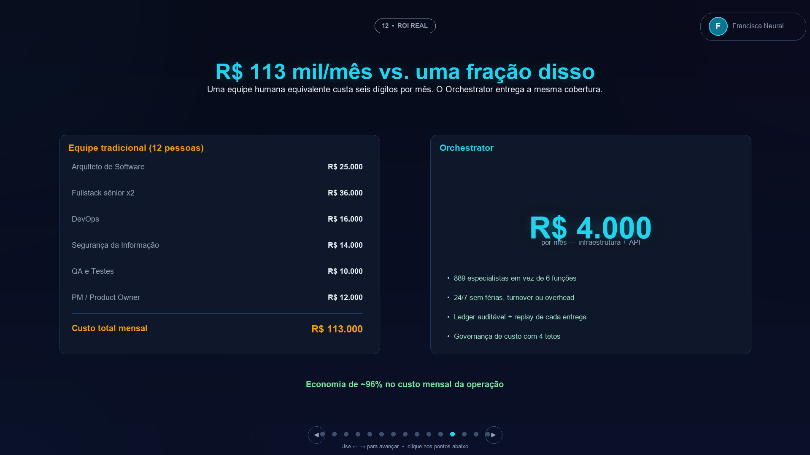
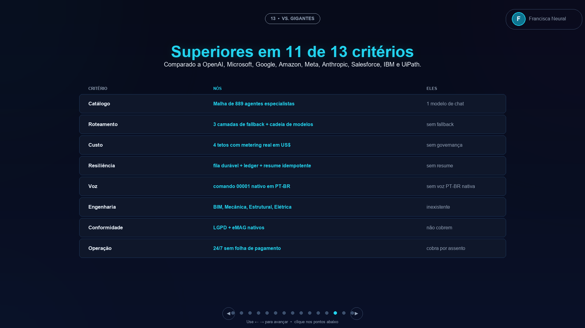
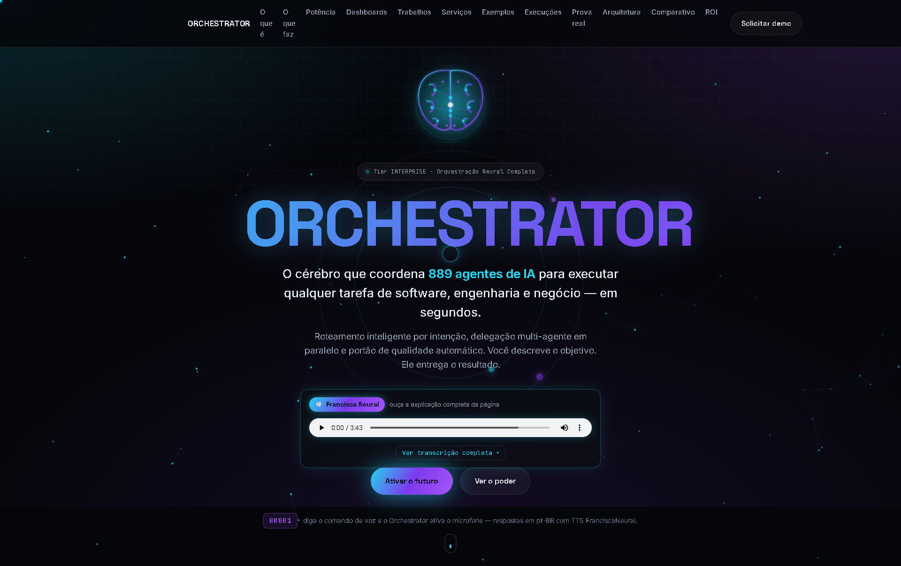
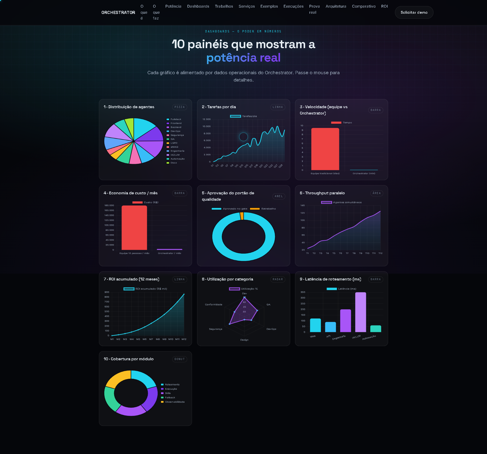

# ORCHESTRATOR

### Plataforma de Orquestração Neural Multiagente

**894 agentes de IA especializados · 960 testes automatizados · v4.51.0**

*O cérebro que coordena 894 agentes de IA para executar qualquer tarefa de software, engenharia e negócio — em segundos.*

---

## Visão geral

O **Orchestrator** é uma plataforma de orquestração multiagente de produção — não um protótipo, não um wrapper de LLM. Ele recebe um objetivo em linguagem natural, identifica a intenção, seleciona o especialista certo entre **894 agentes catalogados**, delega a execução em paralelo e audita cada decisão.

O projeto demonstra, em código real e operação contínua:

- **Roteamento por intenção** — keyword matching com score de especificidade + resgate semântico, confiança explícita e fallback automático em 3+1 camadas
- **Orquestração multiagente** — planos decompostos em ondas de DAG, delegação paralela com `subagent_type` tipado e validado por registry
- **Tiering cognitivo de modelos** — o avaliador aprova ou reprova a saída do modelo econômico; reprovação escala automaticamente para o tier mais forte. Paga-se caro apenas quando necessário
- **Governança de custo** — 4 tetos de budget (US$/tokens por run, domínio e agente) com metering real e políticas abort/downgrade/notify
- **Resiliência** — fila durável SQLite com leases, retry com backoff, idempotência por step-key e resume de runs interrompidos
- **Auditabilidade** — ledger append-only (event sourcing leve) com replay completo de cada run
- **Observabilidade** — métricas Prometheus, 21 painéis Grafana, logs estruturados JSONL e health persistente por agente
- **Qualidade de release** — 960 testes automatizados, portão de 100% de cobertura do núcleo, catálogo validado por JSON Schema
- **MCP & Context Engineering** — integração via Model Context Protocol, regras anti-alucinação (PlayMode) com exploração automática de codebase
- **Engenharia real** — agentes verticais de BIM (FreeCAD→IFC), mecânica (OpenSCAD→STL), estrutural (CalculiX FEM), elétrica (KiCad→Gerbers) e verticais brasileiras (LGPD, eMAG, Pix/BACEN, licitações, reforma tributária)
- **Voz nativa** — comando de voz `00001` com respostas TTS em pt-BR

> O código-fonte é proprietário. Este repositório é uma vitrine técnica: arquitetura, métricas e evidências de produção.

---

## Arquitetura (visão de alto nível)

**Seis camadas do sistema:** Interface (voz/CLI/API) → Orquestração (roteamento, planner, DAG) → Execução (fila, retry, sandbox) → Inteligência (agentes, skills, avaliador) → Dados (ledger, métricas, catálogo schema-first) → Infraestrutura (Grafana, Prometheus, CI).

---

## Métricas reais de produção

Extraídas do ledger de execuções — não são estimativas de marketing:

| Métrica | Valor |
|---|---|
| Agentes especializados catalogados | **894** (schema-first, 0 referências quebradas) |
| Testes automatizados | **960** — cobertura 100% do núcleo |
| Núcleo do orquestrador | **5.759 linhas** de pipeline auditável |
| Execuções registradas no ledger | **364 runs** |
| Taxa de sucesso | **97,25%** (41 retries recuperados) |
| Roteamento por objetivo | **< 1s**, determinístico |
| Avaliação de roteamento | **28/28** objetivos corretamente classificados |
| Distribuição de custo | 98% do tráfego no tier econômico/embeddings |
| Auditoria OWASP real | 120 ocorrências em 16 arquivos |
| Releases versionadas | **51** versões com changelog disciplinado |
| Painéis Grafana | **21** |

### Telemetria ao vivo

### Números do ledger

### Arquitetura em seis camadas

### ROI

### Comparativo de mercado

---

## Stack e práticas de engenharia

- **Linguagens:** Python (núcleo), TypeScript/Node (integrações, bridge MCP), JavaScript (site)
- **Qualidade:** pytest com gate `--cov-fail-under`, JSON Schema como contrato, validação referencial de catálogo, suítes unitário/integração/E2E
- **Confiabilidade:** durable queue (SQLite + leases), event sourcing leve, saga-style resume, bounded parallelism por ondas
- **AI-native dev:** orquestração multiagente, MCP, context engineering, spec-first, subagents tipados — o projeto é ao mesmo tempo **produto** e **prova do método**
- **DevOps:** releases semânticas com changelog, CI, sandbox por run, métricas Prometheus
- **Conformidade:** gatilhos automáticos LGPD (ANPD/ROPA) e eMAG 3.1/WCAG 2.2 no planner

---

## Demonstração e evidências

| Recurso | Arquivo |
|---|---|
| 🎬 Vídeo — tour do site (5:52, narrado) | [docs/VIDEO-SITE-ORCHESTRATOR.mp4](docs/VIDEO-SITE-ORCHESTRATOR.mp4) |
| 🎬 Vídeo — apresentação em slides (6:07) | [docs/VIDEO-APRESENTACAO-SLIDES.mp4](docs/VIDEO-APRESENTACAO-SLIDES.mp4) |
| 📄 Comparativo de custos (ROI) | [docs/Orquestrador_Comparativo_Custos.pdf](docs/Orquestrador_Comparativo_Custos.pdf) |

### Artefatos reais gerados pelos agentes

Documentos técnicos produzidos de ponta a ponta pela plataforma — evidência, não mockup:

| Artefato | PDF |
|---|---|
| Relatório de auditoria OWASP (120 ocorrências / 16 arquivos) | [abrir](docs/artefatos-reais/relatorio-auditoria-seguranca-owasp.pdf) |
| Parecer de conformidade LGPD (ROPA, bases legais) | [abrir](docs/artefatos-reais/parecer-conformidade-lgpd.pdf) |
| Especificação de projeto BIM (FreeCAD→IFC4) | [abrir](docs/artefatos-reais/especificacao-projeto-bim.pdf) |
| Análise estrutural FEM (CalculiX, validação analítica) | [abrir](docs/artefatos-reais/relatorio-analise-estrutural-fem.pdf) |
| Projeto de PCB KiCad (placa IoT 2 camadas → Gerbers) | [abrir](docs/artefatos-reais/projeto-pcb-kicad.pdf) |
| Plano de arquitetura de software (894 agentes, gate 960) | [abrir](docs/artefatos-reais/plano-arquitetura-software.pdf) |

 

---

## English summary

**Orchestrator** is a production-grade multi-agent orchestration platform: 894 cataloged AI agents, intent-based routing with explicit confidence and multi-layer fallback, DAG-wave parallel delegation, cognitive model tiering with automatic quality gating and escalation, durable SQLite queues with leases and idempotent resume, an append-only run ledger with full replay, real token/cost metering across 4 budget ceilings, Prometheus/Grafana observability, and a 960-test quality gate at 100% core coverage. It also ships vertical engineering agents (BIM, mechanical, structural FEM, PCB) and Brazil-native compliance automation (LGPD, eMAG, Pix/BACEN). Built end-to-end using AI-native development: MCP, context engineering, spec-first and typed subagents.

---

**Autor:** Wellington Carlos Fick
**Contato:** stayboard.tom@gmail.com

*Arquitetura própria, determinística e auditável — cada decisão explícita, testada e observável.*

